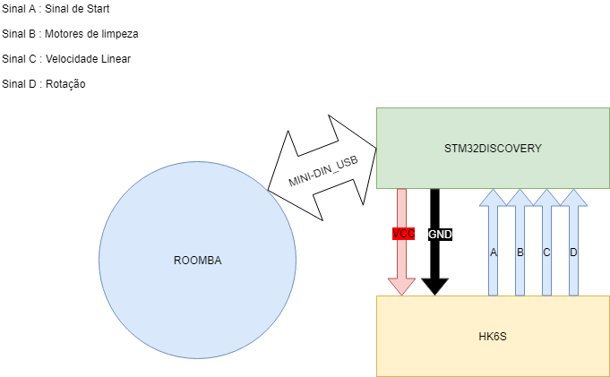
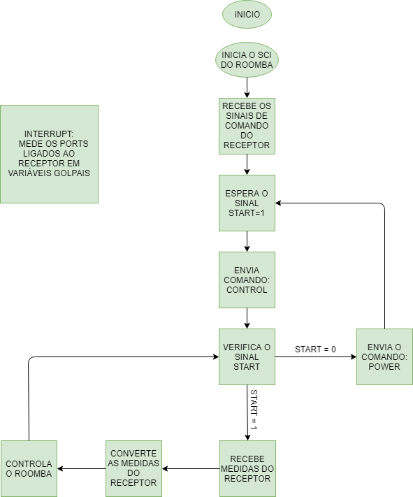

# Roomba controlado remotamente 

## Proposta

  O Roomba é um robo aspirador de pó que limpa recintos automaticamente.Este projeto visa utilizar da interface de comunicação serial do
próprio Roomba(SCI) para, atravéz de um circuito embarcado, pilota-lo remotamente.
  Essa nova funcionalidade permitirá um controle mais preciso em ambientes que dificultariam a limpeza da interligencia artificial, por
exemplo um sala com muitas mesas e cadeiras.
## Periféricos

No projeto serão utilizados:

#### 1 ROOMBA 565
#### 1 STM32F407 Discovery
#### 1 Receptor HK6S

## Pinagem

USB SERIAL -> PA10, PA9 e PA8: USART1 

CH6 HK6S -> PC1: SINAL A

CH5 HK6S -> PC2: SINAL B

CH4 HK6S -> PC15: SINAL C

CH3 HK6S -> PC14: SINAL D

## Fluxogram
  Os canais do recptor são lidas em variaveis glopais através de interrupt, mas (com exeção do sinal start) são recebidas por variavéis
locais na main em em parte especificas do programa

## Interface Usuário
  O Usuário contorlara o Roomba através de uma contorle pareado com o HK6S, sendo o sinal A controlado por um switch os sinais C e D por um
mesmo joystick.

## Referencia
iRobotRoomba®®Serial Command Interface(SCI) Specification

User Manual STM32F407VG

# Links dos trabalhos não presentes neste repositório
I2C: https://github.com/ime-elo2020/Gentil_I2C

Gira_LED: https://github.com/ime-elo2020/Gentil_Gira_LEDs
